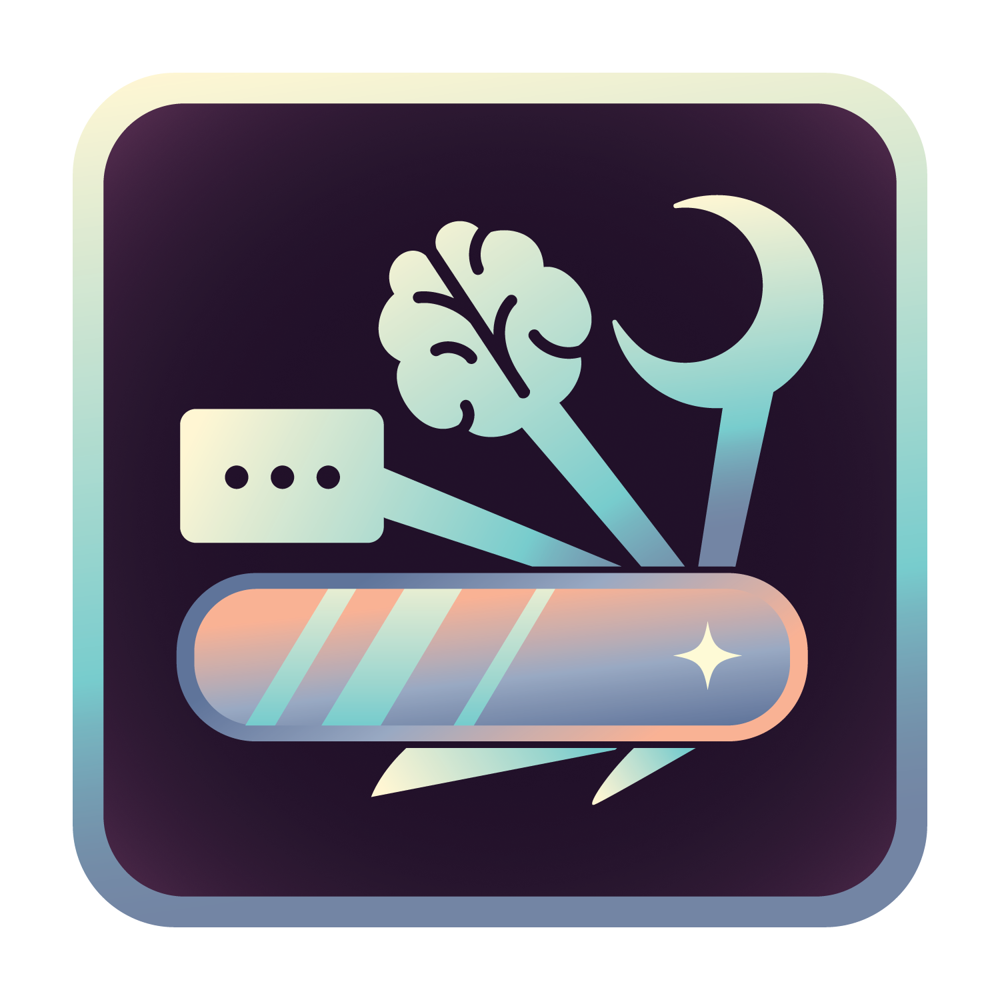

<p align="center">
  
</p>

<h1 align="center">Inoxity Researcher Dashboard</h1>

<p align="center"><em>Durable by design. Open by nature. Driven by curiosity.</em></p>

## Hey there!

Welcome to Inoxity, an open-source research platform for running iPhone studies in people's everyday lives. Inoxity combines Apple Health data (including data from Apple Watch), scheduled surveys and EMA, reminders, and optional photo and video uploads, all configured without writing code.

Each study's participant data goes to a Supabase project that the research team owns and controls. Inoxity never holds it.

This repository is the **Researcher Dashboard**, the website at [inoxity.org](https://www.inoxity.org) where research teams create, configure, and manage their studies. The participant-facing iPhone app lives in [inoxity-app](https://github.com/inoxity/inoxity-app).

> **Status:** Inoxity is undergoing active development and large-scale validation, and will be ready for use soon. [Join the mailing list](https://www.inoxity.org/updates) to hear when it launches, or email Rachael Kee at [rlkee@ucdavis.edu](mailto:rlkee@ucdavis.edu) for early access.

What's in this repo:
1. **The Researcher Dashboard**: a Next.js web app for creating studies, setting up surveys, reminders, Apple Health data and media collection, inviting collaborators, and activating studies. Before a study goes live, it checks the study the same way the app does when a participant enrolls.
2. **Study Backend setup files**: for each study, the dashboard generates two SQL files, one for the database structure and one for security. They set up the team's own Supabase project to work with Inoxity.
3. **The documentation**: the source for the [Inoxity documentation](https://inoxity.readthedocs.io/) on Read the Docs, in [`docs/`](docs/).

---

### Start from Here

New to Inoxity? Start with the documentation:

- [Before you start](https://inoxity.readthedocs.io/en/latest/getting-started/before-you-start/): what you'll need and what to plan before your first study.
- [Researcher workflow](https://inoxity.readthedocs.io/en/latest/getting-started/researcher-workflow/): a study from setup to participants.
- [FAQ](https://inoxity.readthedocs.io/en/latest/faq/) and [Troubleshooting](https://inoxity.readthedocs.io/en/latest/troubleshooting/).

---

### For Developers

```bash
npm install
cp .env.example .env.local   # then fill in the values described in the file
npm run dev                  # http://localhost:3000
npm test                     # unit tests (Vitest)
npm run lint
```

The dashboard is deployed on Vercel. Documentation changes in `docs/` are built by Read the Docs from [`mkdocs.yml`](mkdocs.yml).

---

### License

This project is licensed under the [BSD 3-Clause License](LICENSE). See the [LICENSE](LICENSE) file for full terms.

---

### Acknowledgements

Inoxity was created by **Rachael Kee** (lead developer) with **Laasya Madgula**, in the [Cognitive Communication Science Lab](https://cogcommscience.ucdavis.edu/people) at UC Davis, led by **Richard Huskey**. See [About the team](https://inoxity.readthedocs.io/en/latest/about/).

We're grateful to the following people for their help with Inoxity's development and validation:

- **Emorie Beck**, Associate Professor, Department of Psychology, University of California, Davis
- **Allison Eden**, Associate Professor, Department of Communication, Michigan State University
- **Morgan Ellithorpe**, Associate Professor, Department of Communication, University of Delaware
- **Ian Kim**, Assistant Professor, School of Kinesiology, University of Michigan
- **Aaron Luellen**, Independent web developer

---

### Contact

For questions about using Inoxity, early access, or collaboration, please contact:
**Rachael Kee**: [rlkee@ucdavis.edu](mailto:rlkee@ucdavis.edu)

For support with a running study: [inoxity.team@gmail.com](mailto:inoxity.team@gmail.com)
